# Manifest for Node.js

[](https://github.com/mnfst/manifest-node/actions/workflows/ci.yml)
[](https://www.npmjs.com/package/manifest)
[](https://www.npmjs.com/package/manifest)

**An API rejects your request. Manifest fixes it and retries. You do nothing.**

```sh
npm install manifest
```

```js
import { manifest } from 'manifest';

manifest(); // once, at startup
// Keep making your API calls as usual.
```

Works with built-in `fetch`, `node:http`, `node:https` and Axios, for JSON and form-urlencoded bodies. Node.js 22+. TypeScript, ESM and CommonJS. Zero dependencies.



## Setup

1. Create a project in your Manifest dashboard and copy its project key.
2. Turn on **Autofix** in **Project Settings**.
3. Set the key:

```sh
export MNFST_KEY='your-project-key'
```

Call `manifest()` before any library grabs its own reference to `fetch` or `node:http`.

## See it work

```js
import { manifest } from 'manifest';

manifest({
  onHeal(event) {
    console.log('[manifest]', event.healStatus, event.replayStatusCode);
  },
});

const res = await fetch('https://api.example.com/orders', {
  method: 'POST',
  headers: { 'content-type': 'application/json' },
  body: JSON.stringify({ limit: 500 }), // rejected? Manifest retries with a valid limit
});
```

## Good to know

- **Retries repeat side effects.** Use idempotency keys on non-idempotent calls.
- **A heal adds up to 60 s** to a failed request. Successful requests are untouched.
- **Not intercepted:** browsers, HTTP/2, and directly imported `undici`/`node-fetch`.
- **Privacy.** Failed URLs, headers, JSON or form-urlencoded bodies, and error responses are sent to Manifest. Known credentials are masked, but nested secrets and business data are not. Enable it only for traffic you allow Manifest to process.

## More

[Configuration, limits & development](docs/guide.md) · [API contract](CONTRACT.md) · [Python SDK](https://github.com/mnfst/manifest-python)
